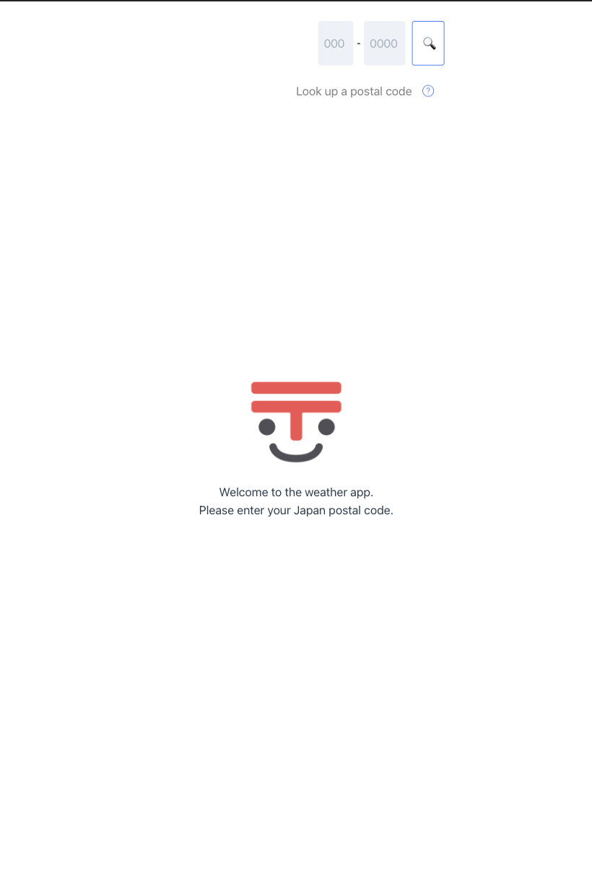

# The Weather App: Life Info from Postal Code
An easy SPA to get the daily life information you need. 
Enter your Japan postal code and get the local weather & news!  
*For best experience, please run a local version on a computer, as the mobile version may not render certain components correctly.*

## Demo
Please watch the demo video [here](https://drive.google.com/file/d/1RW_WP2yGHn7uDur2T74duTVIX7oYGcVF/view?usp=sharing).

## How to use
*The below is a demonstration of the <ins>localhost version</ins>. Please note that the news section may not visible on the web version due to News API free plan limitations. If you would like the full experience, please <strong>install and obtain API keys from the below API reference section to run your localhost version </strong>.*

1. When the user opens the weather app, they are presented with a welcome screen with the two input fields for the first 3 and the next 4 digits of their postal code.
 

</img>

2. After entering a valid postal code, the user is able to see the town name, 3-day weather forecast, a map, and a news article about the entered area.

 

</img>  
 

*The news information is not available if the News API reaches daily call limit \(50 requests per 12 hours\) or if requested from the web version app and the following message will show.*

</img>  
 

3. If the user enters an invalid postal code, the user will see the error message screen, as below. Under the input field, there is a button that takes the user to Japan Post website to lookup the target postal code.
 

</img> 

 

The web version is hosted [here](https://weather-app-brianlee9090.vercel.app/).

## Tech/framework used
<b>Built with</b>
- [Vue](https://vuejs.org/)
- [Chakra UI Vue](https://vue.chakra-ui.com/)

## Features
With a press of a button, you can see:
1. A 3-day forecast with dates, weather, highs, and lows
2. A map of the area entered, clickable to view on Google Maps
3. A selected news article about the area, clickable to read the full article

Other convenient/safeguard features include:
1. A button to look up postal code/Japan Post
2. Error message for invalid postal code entry
3. Picks up prefectural news if no news about enter town is available

## Install

    $ git clone https://github.com/brianlee9090/weather-app.git
    $ npm install

## API Reference
<b>APIs incorporated</b>
- [Openweather Weather API](https://openweathermap.org/)
- [News API](https://newsapi.org/)
- [Postal Code API](https://github.com/madefor/postal-code-api/)
- [Google Static Map API](https://developers.google.com/maps/documentation/maps-static)

## Contribute
If you have any suggestions to make this app better, feel free to fork the repo and create a pull request.
If you like this project, please give us a star! ⭐️

## License
MIT © [Brian Lee](https://github.com/brianlee9090)
